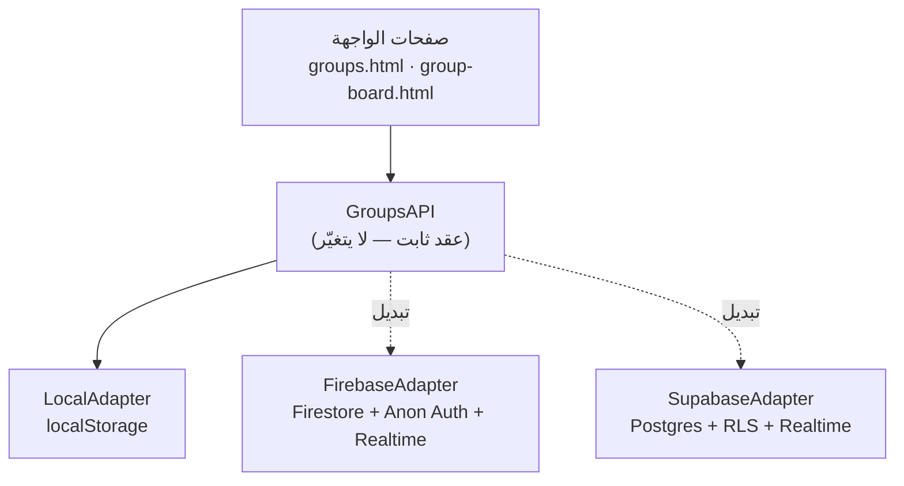

# دليل ربط «التنافس العائلي» بالخادم — Firebase / Supabase

> **الركيزة الرابعة:** مجموعات التنافس العائلي (Anonymous Groups) في تطبيق *زاد*.
> هذا الدليل يشرح كيف تُحوِّل الميزة من **وضعٍ محلي تجريبي** إلى **مزامنةٍ حيّة بين الأجهزة** دون تغيير أي سطرٍ في صفحات التطبيق (`groups.html` / `group-board.html`).

---

## 0. الخلاصة في سطر

الميزة مبنية على **نمط المحوّل (Adapter Pattern)**. كل المنطق يمرّ عبر واجهة واحدة `GroupsAPI` في `js/groups.js`. اليوم يُنفِّذها `LocalAdapter` (محلي بـ `localStorage`). للربط الحقيقي تستبدل سطر التصدير فقط:

```js
// js/groups.js — آخر الملف
const Groups = LocalAdapter;            // ← قبل
const Groups = chooseAdapter();         // ← بعد (راجع §5)
```

ثم تُسقِط ملف محوّلٍ واحد (`FirebaseAdapter` أو `SupabaseAdapter`). الصفحات لا تتغيّر إطلاقاً لأنها لا تعرف سوى `GroupsAPI`.

---

## 1. المعمارية



| الطبقة | المسؤولية | تتغيّر عند الربط؟ |
|---|---|---|
| الواجهة (Presentation) | عرض اللوحة والهوية والدعوة | **لا** |
| العقد (`GroupsAPI`) | توقيعات الدوال + نماذج البيانات | **لا** |
| المحوّل (Adapter) | تنفيذ التخزين/المزامنة الفعلي | **نعم** (تستبدله) |
| الخادم (Backend) | Firestore / Postgres + Realtime | جديد |

**مبدأ التصميم:** الواجهة تعتمد على *تجريد* لا على *تنفيذ* (Dependency Inversion). هذا يوافق توجيهات الفصل بين الطبقات في TOGAF (Application ↔ Technology) ويُبقي بدائل النشر مفتوحة (NORA: قابلية التبديل وتفادي الاحتكار للمورّد).

---

## 2. عقد الواجهة `GroupsAPI`

أي محوّلٍ **يجب** أن يطبّق هذه الدوال بنفس التواقيع (كلها تُعيد `Promise` عدا `getMe`):

```ts
interface GroupsAPI {
  getMe(): { id: string; alias: string };       // الهوية المجهولة المحلية
  setAlias(alias: string): Promise<void>;
  listGroups(): Promise<Group[]>;                // مجموعاتي فقط
  getGroup(groupId: string): Promise<Group|null>;// مع أعضائها
  createGroup(name: string): Promise<Group>;     // يُنشئ + يُضيفني عضواً
  joinGroup(code: string): Promise<Group>;       // بحث بالرمز + إضافتي
  leaveGroup(groupId: string): Promise<void>;
  syncMyStats(groupId: string): Promise<void>;   // يرفع %/streak/badge فقط
  // أدوات مساعدة (محلية، تبقى كما هي):
  rankMembers(members): Member[];
  myCompletionPct(): number;
  deepLink(groupId: string): string;             // zaad://group/join/[groupId]
}
```

### نماذج البيانات (ثابتة عبر كل المحوّلات)

```ts
type Member = {
  id: string;        // UUID مجهول (= auth.uid عند الربط)
  alias: string;     // اسم مستعار ≤ 24 حرفاً
  pct: number;       // نسبة الإنجاز اليومية 0..100
  streak: number;    // أيام اللهب
  badge: string;     // رمز الوسام (إيموجي)
  isMe?: boolean;    // يُحسب عند القراءة
};

type Group = {
  id: string; name: string; code: string;
  createdAt: number; members: Member[];
};
```

### 🔒 ثابتة الخصوصية (Invariant) — غير قابلة للتفاوض
عبر حدود الجهاز لا يعبُر سوى: **`alias` · `pct` · `streak` · `badge`**.
**يُمنع** عبور: نوع العبادة أو تفاصيلها، الاسم الحقيقي، البريد/الهاتف، الموقع، أو أي PII.
نسبة الإنجاز تُحسب على الجهاز (`myCompletionPct()` يقرأ `zad_v2.worship`) ويُرفَع **الرقم فقط**. حجم أي حمولة مزامنة **< 5KB**.

---

## 3. الخيار (أ) — Firebase

### 3.1 نموذج البيانات (Firestore)

```
groups/{groupId}
  ├─ name: string (≤40)
  ├─ code: string            // رمز الدعوة (للبحث)
  ├─ createdBy: uid
  ├─ createdAt: serverTimestamp
  └─ memberIds: [uid, …]     // لاستعلام array-contains
groups/{groupId}/members/{uid}
  ├─ alias: string (≤24)
  ├─ pct: number (0..100)
  ├─ streak: number
  ├─ badge: string
  └─ updatedAt: serverTimestamp
```

> فصلنا الإحصاءات في `members/{uid}` لأنها تُكتب كثيراً (مزامنة) بينما وثيقة المجموعة شبه ثابتة — يقلّل التعارض ويُسهّل الاستماع الحيّ.

### 3.2 المصادقة المجهولة
استخدم **Anonymous Auth** ليصبح `auth.uid` هو المُعرّف المجهول الدائم (بديلاً عن الـ UUID المُولَّد محلياً — راجع §7 للترحيل). لا بريد، لا هاتف.

### 3.3 قواعد الأمان (Security Rules)

```
rules_version = '2';
service cloud.firestore {
  match /databases/{db}/documents {
    function signedIn() { return request.auth != null; }
    function uid() { return request.auth.uid; }
    function isMemberOf(gid) {
      return signedIn() && uid() in get(/databases/$(db)/documents/groups/$(gid)).data.memberIds;
    }

    match /groups/{gid} {
      allow read:   if isMemberOf(gid);
      allow create: if signedIn()
                    && request.resource.data.createdBy == uid()
                    && request.resource.data.memberIds == [uid()]
                    && request.resource.data.name is string
                    && request.resource.data.name.size() <= 40;
      // الانضمام: يُسمح فقط بإضافة معرّفك أنت إلى memberIds
      allow update: if signedIn()
                    && request.resource.data.diff(resource.data).affectedKeys().hasOnly(['memberIds'])
                    && request.resource.data.memberIds == resource.data.memberIds.concat([uid()]);

      match /members/{mid} {
        allow read:  if isMemberOf(gid);
        // كلٌّ يكتب صفّه فقط، والحقول المسموحة فقط، وبقيمٍ صحيحة
        allow write: if signedIn() && mid == uid()
                     && request.resource.data.keys().hasOnly(['alias','pct','streak','badge','updatedAt'])
                     && request.resource.data.pct is number
                     && request.resource.data.pct >= 0 && request.resource.data.pct <= 100
                     && request.resource.data.alias.size() <= 24;
      }
    }
  }
}
```

> **تقوية اختيارية:** لو أردت ضمان تكامل الانضمام بصرامة (منع التلاعب بـ `memberIds`)، انقل عملية الانضمام إلى **Callable Cloud Function** تتحقق من الرمز وتُضيف العضو بصلاحية الخادم، واجعل `update` على `memberIds` مرفوضاً للعملاء.

### 3.4 `FirebaseAdapter` (جاهز للّصق — وحدة ES)

ضعه في `js/groups.firebase.js` واستورِده بدل `LocalAdapter`:

```js
import { initializeApp } from 'https://www.gstatic.com/firebasejs/10.12.0/firebase-app.js';
import { getAuth, signInAnonymously, onAuthStateChanged }
  from 'https://www.gstatic.com/firebasejs/10.12.0/firebase-auth.js';
import {
  getFirestore, collection, doc, setDoc, getDoc, getDocs, deleteDoc,
  query, where, limit, onSnapshot, serverTimestamp, arrayUnion, updateDoc, addDoc
} from 'https://www.gstatic.com/firebasejs/10.12.0/firebase-firestore.js';

const app = initializeApp({ /* firebaseConfig */ });
const auth = getAuth(app);
const db   = getFirestore(app);

// نعيد استخدام أدوات الحساب المحلية من LocalAdapter (الخصوصية: الرقم فقط)
const WORSHIP_KEYS = ['fajr','zuhr','asr','maghrib','isha','rawatib','duha','qiyam',
                      'morning_dhikr','evening_dhikr','takbeer_100','tawbah'];
function readState(){ try{ return JSON.parse(localStorage.getItem('zad_v2')||'{}')||{}; }catch(e){ return {}; } }
function myCompletionPct(){ const w=(readState().worship)||{}; const d=WORSHIP_KEYS.filter(k=>w[k]).length; return Math.round(d/WORSHIP_KEYS.length*100); }
function myStreak(){ return readState().streak||0; }
function myBadge(){ const s=myStreak(); return s>=9?'🏆':s>=5?'🥇':s>=3?'🥈':s>=1?'🔥':'🌱'; }
function rankMembers(m){ return m.slice().sort((a,b)=> b.pct!==a.pct ? b.pct-a.pct : (b.streak||0)-(a.streak||0)); }
function code6(){ const c='ABCDEFGHJKLMNPQRSTUVWXYZ23456789'; let o=''; for(let i=0;i<6;i++) o+=c[Math.random()*c.length|0]; return o; }

let _uid = null, _alias = '';
const ready = new Promise(res => {
  onAuthStateChanged(auth, u => { if(u){ _uid=u.uid; res(); } });
  signInAnonymously(auth).catch(console.error);
});

async function myMemberPayload(){
  return { alias:_alias||'أنا', pct:myCompletionPct(), streak:myStreak(), badge:myBadge(), updatedAt:serverTimestamp() };
}
async function loadMembers(gid){
  const snap = await getDocs(collection(db,'groups',gid,'members'));
  return snap.docs.map(d => ({ id:d.id, ...d.data(), isMe: d.id===_uid }));
}

export const FirebaseAdapter = {
  isLocal:false, rankMembers, myCompletionPct,
  deepLink: gid => 'zaad://group/join/'+gid,

  getMe(){ return { id:_uid, alias:_alias }; },
  async setAlias(alias){ await ready; _alias=(alias||'').trim().slice(0,24); },

  async listGroups(){
    await ready;
    const q = query(collection(db,'groups'), where('memberIds','array-contains',_uid));
    const gs = await getDocs(q);
    return Promise.all(gs.docs.map(async g => ({ id:g.id, ...g.data(), members: await loadMembers(g.id) })));
  },

  async getGroup(gid){
    await ready;
    const g = await getDoc(doc(db,'groups',gid));
    if(!g.exists()) return null;
    return { id:g.id, ...g.data(), members: await loadMembers(gid) };
  },

  async createGroup(name){
    await ready;
    const ref = await addDoc(collection(db,'groups'), {
      name:(name||'مجموعتي').trim().slice(0,40), code:code6(),
      createdBy:_uid, createdAt:serverTimestamp(), memberIds:[_uid]
    });
    await setDoc(doc(db,'groups',ref.id,'members',_uid), await myMemberPayload());
    return this.getGroup(ref.id);
  },

  async joinGroup(code){
    await ready;
    code=(code||'').trim().toUpperCase();
    const q = query(collection(db,'groups'), where('code','==',code), limit(1));
    const r = await getDocs(q);
    if(r.empty) throw new Error('رمز غير صالح');
    const gid = r.docs[0].id;
    await updateDoc(doc(db,'groups',gid), { memberIds: arrayUnion(_uid) });
    await setDoc(doc(db,'groups',gid,'members',_uid), await myMemberPayload());
    return this.getGroup(gid);
  },

  async leaveGroup(gid){
    await ready;
    await deleteDoc(doc(db,'groups',gid,'members',_uid));
    // إزالة المعرّف من memberIds عبر Cloud Function أو arrayRemove
  },

  async syncMyStats(gid){
    await ready;
    await setDoc(doc(db,'groups',gid,'members',_uid), await myMemberPayload(), { merge:true });
  },

  // اشتراك حيّ للوحة الصدارة (اختياري): استدعِه من group-board.html
  subscribe(gid, cb){
    return onSnapshot(collection(db,'groups',gid,'members'),
      snap => cb(snap.docs.map(d => ({ id:d.id, ...d.data(), isMe:d.id===_uid }))));
  }
};
```

---

## 4. الخيار (ب) — Supabase

### 4.1 السكيمة (PostgreSQL)

```sql
create table groups (
  id          uuid primary key default gen_random_uuid(),
  name        text not null check (char_length(name) <= 40),
  code        text not null unique,
  created_by  uuid not null default auth.uid(),
  created_at  timestamptz not null default now()
);

create table group_members (
  group_id    uuid not null references groups(id) on delete cascade,
  user_id     uuid not null default auth.uid(),
  alias       text not null check (char_length(alias) <= 24),
  pct         int  not null default 0 check (pct between 0 and 100),
  streak      int  not null default 0,
  badge       text,
  updated_at  timestamptz not null default now(),
  primary key (group_id, user_id)
);
```

### 4.2 أمان مستوى الصف (RLS)

```sql
alter table groups        enable row level security;
alter table group_members enable row level security;

-- دالة مساعدة بصلاحية المُعرِّف لتفادي التكرار الحلقي في RLS
create or replace function is_member(gid uuid) returns boolean
language sql security definer stable as $$
  select exists(select 1 from group_members m
                where m.group_id = gid and m.user_id = auth.uid());
$$;

-- groups
create policy "read my groups"  on groups for select using (is_member(id));
create policy "create group"    on groups for insert with check (created_by = auth.uid());

-- group_members: أقرأ أعضاء مجموعاتي، وأكتب صفّي فقط
create policy "read members"    on group_members for select using (is_member(group_id));
create policy "insert my row"   on group_members for insert with check (user_id = auth.uid());
create policy "update my row"   on group_members for update using (user_id = auth.uid()) with check (user_id = auth.uid());
create policy "delete my row"   on group_members for delete using (user_id = auth.uid());

-- تفعيل الزمن الحقيقي
alter publication supabase_realtime add table group_members;
```

### 4.3 `SupabaseAdapter` (جاهز للّصق)

```js
import { createClient } from 'https://esm.sh/@supabase/supabase-js@2';
const sb = createClient('https://YOUR.supabase.co', 'YOUR_ANON_KEY');

const WORSHIP_KEYS = ['fajr','zuhr','asr','maghrib','isha','rawatib','duha','qiyam',
                      'morning_dhikr','evening_dhikr','takbeer_100','tawbah'];
function readState(){ try{ return JSON.parse(localStorage.getItem('zad_v2')||'{}')||{}; }catch(e){ return {}; } }
function myCompletionPct(){ const w=(readState().worship)||{}; return Math.round(WORSHIP_KEYS.filter(k=>w[k]).length/WORSHIP_KEYS.length*100); }
function myBadge(){ const s=readState().streak||0; return s>=9?'🏆':s>=5?'🥇':s>=3?'🥈':s>=1?'🔥':'🌱'; }
function rankMembers(m){ return m.slice().sort((a,b)=> b.pct!==a.pct ? b.pct-a.pct : (b.streak||0)-(a.streak||0)); }
function code6(){ const c='ABCDEFGHJKLMNPQRSTUVWXYZ23456789'; let o=''; for(let i=0;i<6;i++) o+=c[Math.random()*c.length|0]; return o; }

let _uid=null, _alias='';
const ready = sb.auth.signInAnonymously().then(({data})=>{ _uid=data.user.id; });

function row(){ return { user_id:_uid, alias:_alias||'أنا', pct:myCompletionPct(), streak:readState().streak||0, badge:myBadge(), updated_at:new Date().toISOString() }; }
async function members(gid){
  const { data } = await sb.from('group_members').select('*').eq('group_id',gid);
  return (data||[]).map(m => ({ id:m.user_id, alias:m.alias, pct:m.pct, streak:m.streak, badge:m.badge, isMe:m.user_id===_uid }));
}

export const SupabaseAdapter = {
  isLocal:false, rankMembers, myCompletionPct,
  deepLink: gid => 'zaad://group/join/'+gid,
  getMe(){ return { id:_uid, alias:_alias }; },
  async setAlias(a){ await ready; _alias=(a||'').trim().slice(0,24); },

  async listGroups(){
    await ready;
    const { data } = await sb.from('groups').select('id,name,code,created_at');
    return Promise.all((data||[]).map(async g => ({ id:g.id, name:g.name, code:g.code, createdAt:+new Date(g.created_at), members: await members(g.id) })));
  },
  async getGroup(gid){
    await ready;
    const { data:g } = await sb.from('groups').select('id,name,code,created_at').eq('id',gid).single();
    if(!g) return null;
    return { id:g.id, name:g.name, code:g.code, createdAt:+new Date(g.created_at), members: await members(gid) };
  },
  async createGroup(name){
    await ready;
    const { data:g, error } = await sb.from('groups').insert({ name:(name||'مجموعتي').slice(0,40), code:code6(), created_by:_uid }).select().single();
    if(error) throw error;
    await sb.from('group_members').insert({ group_id:g.id, ...row() });
    return this.getGroup(g.id);
  },
  async joinGroup(code){
    await ready;
    const { data:g } = await sb.from('groups').select('id').eq('code',code.trim().toUpperCase()).single();
    if(!g) throw new Error('رمز غير صالح');
    await sb.from('group_members').upsert({ group_id:g.id, ...row() });
    return this.getGroup(g.id);
  },
  async leaveGroup(gid){ await ready; await sb.from('group_members').delete().eq('group_id',gid).eq('user_id',_uid); },
  async syncMyStats(gid){ await ready; await sb.from('group_members').upsert({ group_id:gid, ...row() }); },

  // زمن حقيقي للوحة الصدارة (اختياري)
  subscribe(gid, cb){
    return sb.channel('grp:'+gid)
      .on('postgres_changes', { event:'*', schema:'public', table:'group_members', filter:'group_id=eq.'+gid },
          async () => cb(await members(gid)))
      .subscribe();
  }
};
```

---

## 5. اختيار المحوّل وتشغيله (Online / Offline)

في آخر `js/groups.js` استبدِل التصدير الثابت بمُحدِّدٍ ذكي يحافظ على العمل أوفلاين:

```js
function chooseAdapter(){
  // أوفلاين أو بلا تهيئة خادم → المحوّل المحلي
  if(!navigator.onLine || !window.__ZAD_BACKEND__) return LocalAdapter;
  return window.__ZAD_BACKEND__ === 'supabase' ? SupabaseAdapter : FirebaseAdapter;
}
window.Groups = chooseAdapter();
```

**نمط مقترح:** اعمل بـ `LocalAdapter` افتراضياً، وزامِن مع الخادم في الخلفية (Write-Behind): خزّن محلياً فوراً ثم ادفع `syncMyStats` عند توفّر الشبكة، مع طابور بسيط لإعادة المحاولة. يحافظ على وعد التطبيق: «يعمل 100% أوفلاين».

---

## 6. رابط الدعوة (Deep Link)

الصيغة المعتمدة: `zaad://group/join/[groupId]` (مولَّدة عبر `Groups.deepLink`).

- **PWA / ويب:** أضف بديلاً ويبياً يُحوِّل للرمز — مثلاً `https://zad.app/groups.html?join=CODE`. الصفحة `groups.html` تقرأ `?join=` تلقائياً وتملأ حقل الرمز.
- **أندرويد:** عرّف الـ scheme في `manifest.json` ضمن `protocol_handlers`، أو App Links للنطاق.
- **iOS:** Universal Links عبر `apple-app-site-association` إن أُطلق غلافٌ أصلي.

```jsonc
// manifest.json
"protocol_handlers": [
  { "protocol": "web+zaad", "url": "/groups.html?join=%s" }
]
```

---

## 7. ترحيل البيانات المحلية (Local → Cloud)

عند أول دخولٍ متصل، رحِّل ما خزّنه المستخدم محلياً:

```js
async function migrateLocalToCloud(){
  const local = JSON.parse(localStorage.getItem('zad_v2')||'{}').groups;
  if(!local || local._migrated) return;
  // المُعرّف المعتمد يصبح auth.uid (لا الـ UUID المحلي)
  for(const g of (local.list||[])){
    try{ await Groups.joinGroup(g.code); }   // أعِد الانضمام بالرمز
    catch(_){ /* مجموعة محلية بحتة — تُنشأ من جديد إن لزم */ }
  }
  local._migrated = true;
  const s = JSON.parse(localStorage.getItem('zad_v2')||'{}'); s.groups=local;
  localStorage.setItem('zad_v2', JSON.stringify(s));
}
```

> الأعضاء «التوضيحيون» في الوضع المحلي لا يُرحَّلون — تُستبدل بأعضاء الخادم الحقيقيين تلقائياً.

---

## 8. الخصوصية والأمان — قائمة تحقق

- [x] **مصادقة مجهولة** (Anonymous Auth) — لا بريد/هاتف، `auth.uid` كمُعرّفٍ غير مرتبطٍ بهوية.
- [x] **حقول مسموحة فقط** عبر القواعد/RLS: `alias, pct, streak, badge` — مرفوضٌ أي حقلٍ آخر.
- [x] **التحقق من المدى:** `pct ∈ [0..100]`، `alias ≤ 24`، `name ≤ 40`.
- [x] **العزل:** كلٌّ يكتب صفّه فقط؛ القراءة محصورة بأعضاء المجموعة.
- [x] **حمولة < 5KB:** صفّ العضو حقولٌ قليلة قصيرة.
- [x] **لا تفاصيل عبادة تعبر الحدّ** — تُحسب النسبة على الجهاز ويُرفع الرقم فقط.
- [ ] **تقوية الانضمام** (مُستحسن): Callable Function للتحقق من الرمز.
- [ ] **تشفير أثناء النقل:** TLS افتراضي في كلا المزوّدين؛ فعّل App Check (Firebase) لمنع إساءة الاستخدام.

---

## 9. الربط بالصفحات الحالية — صفر تغييرات

`groups.html` و`group-board.html` تستدعيان `window.Groups.*` فقط. بعد استبدال التصدير في §5:

- لوحة الصدارة المباشرة (اختياري): في `group-board.html`، لو وُجدت `Groups.subscribe` استبدل النداء اليدوي `render()` باشتراكٍ حيّ:

```js
if (Groups.subscribe) {
  Groups.subscribe(gid, members => paintLeaderboard(Groups.rankMembers(members)));
} else {
  render(); // المسار الحالي (سحب يدوي)
}
```

عدا ذلك، لا شيء يتغيّر في الواجهة.

---

## 10. قائمة تحقّق النشر

1. أنشئ مشروع Firebase/Supabase وفعّل **Anonymous Auth**.
2. الصق السكيمة/المجموعات وقواعد الأمان/RLS من §3 أو §4.
3. أضف `js/groups.firebase.js` أو `js/groups.supabase.js` وحمّله في الصفحتين قبل `js/groups.js`.
4. عيّن `window.__ZAD_BACKEND__ = 'firebase' | 'supabase'`.
5. بدّل التصدير في `js/groups.js` (§5).
6. حدّث `sw.js`: أضف ملف المحوّل إلى `PRECACHE` وارفع `CACHE_VER`.
7. اختبر: إنشاء → دعوة بالرمز/الرابط → ظهور العضو عند جهازٍ ثانٍ → ترتيب بالـ% → مغادرة.
8. راقب الحصص (Quotas) وفعّل App Check / Rate Limiting.

---

## 11. ملاحظة معمارية

| الجانب | القرار | المسوّغ |
|---|---|---|
| الفصل | Adapter خلف عقدٍ ثابت | تبديل المورّد بلا مساس بالواجهة (Tech-agnostic) |
| الخصوصية | حساب على الجهاز + رفع الرقم فقط | تقليل سطح البيانات (Data Minimisation) |
| العدالة | ترتيب بالنسبة لا بالمطلق | تكافؤٌ بين الطفل والبالغ |
| المرونة | Local-first + مزامنة خلفية | يعمل أوفلاين في المصلّى والمشاعر |

يتوافق هذا مع مبادئ **NORA** (قابلية التشغيل البيني، تفادي الاحتكار، حماية البيانات) ومنظور **TOGAF** في فصل طبقتي التطبيق والتقنية، ويُمكن تمثيله في **ArchiMate** بعلاقة *Realization* بين خدمة التطبيق `Family Competition` ومكوّناتها (`GroupsAPI` ← `FirebaseAdapter`/`SupabaseAdapter`).

---

*انتهى الدليل — أي محوّلٍ تكتبه لاحقاً يكفي أن يحترم عقد `GroupsAPI` في §2 ليعمل فوراً مع الصفحات الحالية.*

---

## ملحق: الربط الفعلي لمشروع `zad` (Realtime Database + Auth)

تم تفعيل **Auth (Google + Email)** و**Realtime Database** فعلياً. الكود التالي مُضمَّن في التطبيق:
`js/firebase-init.js` (التهيئة) · `js/firebase-auth.js` (محوّل المصادقة `ZadAuth`) · `js/groups.firebase.js` (محوّل المجموعات على RTDB) — ومربوطة في `groups.html`.

### نموذج بيانات RTDB
```
users/{uid}:        { userMode, khatmaGoal, streak, takbeer:{total,daily}, mushaf:{totalPages,dailyPages}, worship, accent, lastSync }
groups/{gid}:       { name, code, createdBy, createdAt, members/{uid}:{alias,pct,streak,badge,updatedAt} }
codes/{CODE}:       gid          // فهرس الانضمام بالرمز
userGroups/{uid}/{gid}: true     // فهرس مجموعاتي
```
> الأدعية الشخصية (`personalDua`) وملاحظات المهام **لا تُرفع إطلاقاً** — تبقى في `localStorage`.

### قواعد أمان Realtime Database (الصقها في Console → Database → Rules)
```json
{
  "rules": {
    "users": {
      "$uid": {
        ".read": "auth != null && auth.uid === $uid",
        ".write": "auth != null && auth.uid === $uid"
      }
    },
    "groups": {
      "$gid": {
        ".read": "auth != null && data.child('members').child(auth.uid).exists()",
        ".write": "auth != null && (!data.exists() || data.child('createdBy').val() === auth.uid)",
        "members": {
          "$uid": {
            ".write": "auth != null && $uid === auth.uid",
            ".validate": "newData.hasChildren(['alias','pct']) && newData.child('pct').isNumber() && newData.child('pct').val() >= 0 && newData.child('pct').val() <= 100 && newData.child('alias').isString() && newData.child('alias').val().length <= 24"
          }
        }
      }
    },
    "codes":      { ".read": "auth != null", "$code": { ".write": "auth != null" } },
    "userGroups": { "$uid": { ".read": "auth != null && auth.uid === $uid", ".write": "auth != null && auth.uid === $uid" } }
  }
}
```

### إعدادات لازمة في Console
1. **Authorized domains** (Authentication → Settings): أضِف نطاق استضافتك (`zad.web.app`، `zad.firebaseapp.com`، و`localhost` للتجربة، وأي نطاق مخصّص) — وإلا يفشل تسجيل دخول Google.
2. **API key restriction** (Google Cloud Console → Credentials): قيّد مفتاح الويب على نطاقاتك (HTTP referrers).
3. القواعد أعلاه تمنع أيّ مستخدمٍ من الكتابة في صفِّ غيره، وتُلزم `pct ∈ [0..100]`.

### التحقق (في متصفحك — لا يمكن اختباره في بيئة التوليد)
1. افتح `groups.html` → بطاقة «ربط الحساب السحابي» → **الدخول عبر Google**.
2. لو نجح، تظهر «✅ مُسجَّل الدخول» مع **UID الحقيقي**، ويُطبع في الـ Console: `[Zad] UID الحقيقي: …`.
3. اضغط **«مزامنة بياناتي الآن»** → تُكتب `users/{uid}` في RTDB، وتُفعَّل المجموعات السحابية (حدّث الصفحة) فتعمل `groups.html`/`group-board.html` على RTDB تلقائياً (نفس عقد `GroupsAPI`).
